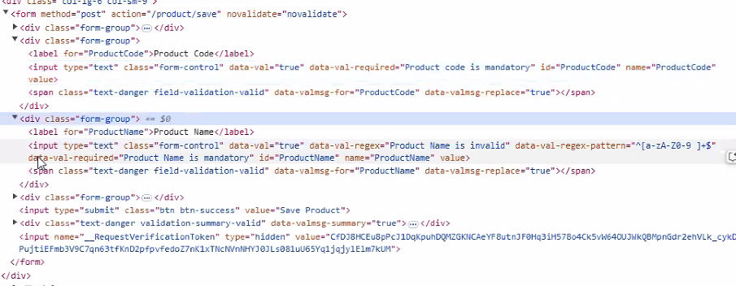
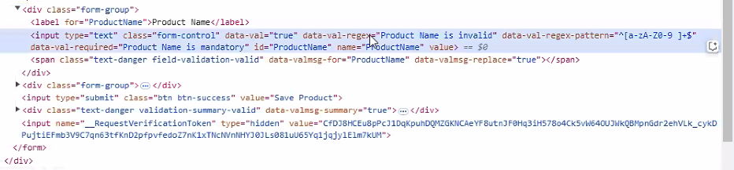
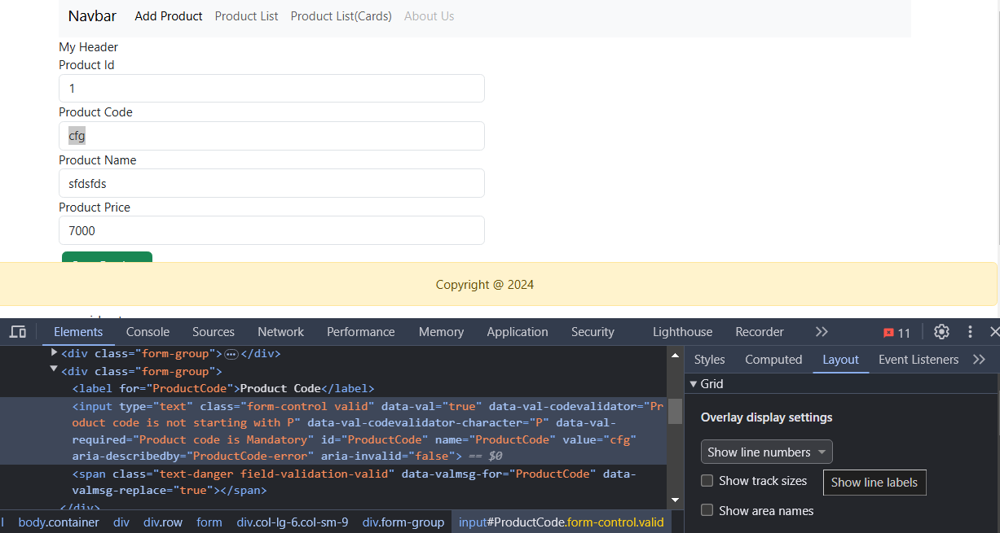
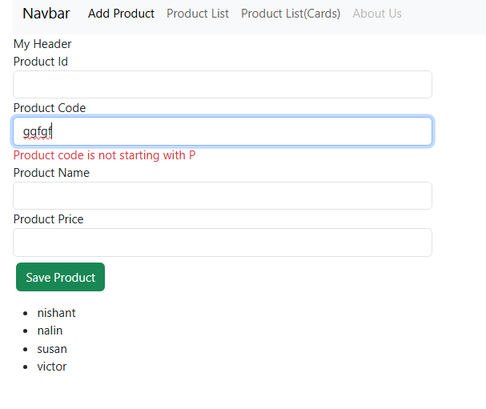
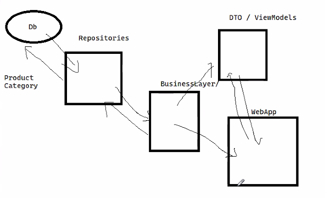

# .NET Training by Pradeep


- Visual Studio 17.11 update includes .NET 8
- .NET 1.0 was launched in 2002.
- .NET 2.0 was launched in 2005.(Very successful)
- .NET 3.5 was released in 2008.
- In 2016, .NET Core 1.0 was launched along with .NET 4.5
- In 2016, Microsoft rewrote .NET from scratch.
- 2017 - .NET Core 2.0
- 2019 - .NET Core 3.0/3.1
- 2020 - .NET 5
- 2021 - .NET 6.0
- 2022 - .NET 7.0 (Out of support)
- 2023 - .NET 8.0 (LTS) / .NET 4.8(Traditional)
- 2024 - .NET 9.0 (STS Version)
- 2025 - .NET 10.0 (LTS)
- .NET 8.0 is basically the Core version

## .NET Core 
- Single platform to build apps for web,mobile
- Cross Platform (Windows, Linux and Mac)
- Everything is a nuget package
- Traditional .NET only works in windows.
- Open Source
- Highly Performant and scalable
- Docker (containerization)
- Dotnet CLI
- .NET MAUI (Desktop Application)
- Blazor(Web Apps)
- Xamarin(Mobile Apps)
- Unity (Gaming Application)
- ML.NET (AI apps)
- Cloud (Azure)
- Apache Spark (AI Apps)

- We have compilers that convert code into IL
- We have CLR which can convert IL Code into Machine Code (0s and 1s)
- FCL (foundational core libraries)

## Changes done in .NET Core

### Roslyn Compiler
- Came as part of .NET Core
- Converts code into IL
- Now foundational libraries are known as Core FX
- In .NET Core we convert IL Code into Machine Code using Core CLR (RyuJIT Compiler)
- Modern compiler for compiling C#, VB
- Superb API for code analyzing, code refactoring, generating code
- Gives on the fly code errors.

### Ryu JIT
- Faster, GC
- Cross Platform

 **.NET Apps can be hosted in IIS (Windows) or Nginx (Linux)**
 - We used to have HttpHandler and HttpModules in IIS
 - In .NET Core we have the same IIS Server but HttpHandler and HttpModules has been replaced with Middleware.
 - Now Request will go through middleware pipeline.
 - Middleware pipelines are cross-platform
 - They are software components which are plug and play.

### Kestrel Server
 - Now we also have Kestrel server on the web server
 - Kestrel is a server developed by Microsoft.
 - It is the fastest server to handle requests and responses.
 - Problem is that it can only do request and response. Cannot do sessions in Kestrel. So we need to have a reverse proxy like IIS or Nginx.
 - On top of Kestrel we have IIS and nginx.
 - Sessions, caching is not available in Kestrel so we need IIS.
 - Kestrel is an internal server that is always there as part of .NET Core.
 - Think of Kestrel as a base class which can handle only request and response.
 - .NET Core is 2300% faster at handling requests compared to .NET Framework 4.6
 - All requests go to IIS or nginx first,  then it goes to Kestrel.
 - A reverse proxy sits between client and web server(kestrel)
 - Reverse proxy like IIS or Nginx can handle SSL Termination, Caching, Load Balancing, Security
 - Web.config is only readable by IIS Server, so it's not there in .NET Core. We have appsettings.json

## Differences between Http Handler, Http Modules and Middleware
### HttpHandler
- Purpose: Processes HTTP requests based on file extensions (e.g., .html, .cs).
- Usage: Used for handling specific types of requests.
- Configuration: Registered in web.config.

### HttpModules
- Purpose: Processes HTTP requests at various stages of the request pipeline.
- Usage: Used for tasks like authentication, logging, and custom header processing.
- Configuration: Registered in web.config.

### Middleware
- Purpose: Provides a unified pipeline for handling HTTP requests.
- Usage: Used for tasks like logging, authentication, and more.
- Configuration: Configured in code, highly flexible and reusable.

**Middleware in ASP.NET Core replaces the need for HttpHandlers and HttpModules by providing a more unified and flexible approach to handling HTTP requests**


## Creating Projects using dotnet CLI
- Can create, build, compile projects
- dotnet new list(to find all the projects that can be created)
- dotnet new mvc --name=name_of_project
- cd name_of_project
- dotnet build
- dotnet run
- dotnet publish
- dotnet core does not support Crystal Reports or SSRS.
- 2 ways to design web applications: MVC and Blazor(Web Assembly wasm)

# ASP.NET Core MVC
- Model, View and Controller
- Separation of Concerns(SoC)
- Requests from server try to find controller first.
- Controller has power to decide which model and view to load
- Views are cshtml pages
- Models are the data
- We have different types of models: data model(bound to database(entities)), business model, presentation model(viewmodel)
- Controller is the brain of MVC
- Views are of different types: Standard View, Strongly Typed View, Layout View, Partial View, ViewComponent(part of partial view)
- In webforms, we used to have aspx attached to cs file. They are co-dependent.
- There is a connection between view and model called ViewModel.
- Dto(Data Transfer Object)-->More like a business object
- Do not use top level statements option(). If this option is not checked, then a class is created and method is defined(public static void main())
- We can have only 1 top level statement in the project

 ## Difference between ASP.NET MVC and ASP.NET Core MVC
- No web.config in core, we have appsettings.json
- web.config is tightly bound to IIS will not work in nginx so we have appsettings.json
- We no longer have Global.asax (Application Start, Application End)
- We now have Program.cs instead of Global.asax
- Instead of HttpHandlers and Modules we have middleware.
- Now we don't have GAC(global assembly cache) instead everything is a nuget package.
- In ASP.NET Core we not only have html helpers we also have tag helpers
- In old ASP.NET MVC we used to have static and dynamic partial views, but for ASP.NET Core we have Static Partial views and we have ViewComponents(dynamic)

## Program.cs
- It has 2 sections
- We need to add services to the container
- Next section is the execution pipeline (which has the middleware)
- Each step in the pipeline is executed.
- Earlier in Startup.cs we used to have ConfigureServices() and Configure() method
- From .NET 6.0 it was removed, now it is included in Program.cs

### wwwroot folder contains all the static files: css/js/pure html files

## Routing
- Serving a webpage based on requested URL
- Matches the pattern of request and execute the code accordingly
```csharp
app.MapControllerRoute(
    name: "default",
    pattern: "{controller=Home}/{action=Index}/{id?}");
```
- Here pattern is controller\action\(optional) id
- MVC based on this pattern will load the screen accordingly.
- We can modify this pattern to suit our requirements
- We can create multiple patterns as well
- curly braces are the placeholder above.
- Types of Routing
  1. Conventional based routing
  2. Attribute based routing
- Internally it creates a route table and there is a route parser
- It will match the route against the pattern in the route table.
- Above is example of Conventional Routing
- For attribute routing we can do this where we use Route attribute.
```csharp
[Route("fc")]
[Route("newname")]
public class FirstController:Controller
{
    [Route("myname")]
    public string GetName() => "FirstController";
    public string GetAddress() => "Chandigarh";
}
```
- app.MapControllerToRoute is a middleware also
- In attribute based routing, the above route attributes are also added to route table.
- In attribute based routing, we don't really need the middleware.
- If we have multiple routing types, attribute based routing is always preferred.
- If attribute routing is provided, conventional routing will not work.

### Model Binder
- We can use model binders to pass values to controller methods
- Maps the matching values from querystring/ route data
- We can have constraints inside route data like city:int
- It binds the arguments of methods
```csharp
 //[Route("address")]
[Route("address/{city:int}/{country}")] 
    public string GetAddress(string city, string country) => $"{city} - {country}";
```
## Razor Pages
- cshtml files that can contain server side code and HTML markup
- Viewbag is syntatic sugar over ViewData
- Viewbag is dynamic
- Viewbag is wrapper around Viewdata
- We can also create views as strongly typed views (View has the datatype defined)
- In this view, we can specify the type of ViewModel inside the Razor page.
- We can use @Model keyword.
- We can have only 1 Model inside the view. 

# Html Helpers
- Extension Methods used for generating the HTML code
- Standard Html Helpers
```csharp
 @Html.TextBox("ProductCode")
```
- Strongly Typed Helpers
```csharp
 @Html.TextBoxFor(x=>x.ProductCode)
```
## Binding Form to the Model

```csharp
<div class="row">
    <div class="col-lg-6">
        @using (Html.BeginForm("save", "product", FormMethod.Post))
        {
        <div class="form-group">
            @Html.LabelFor(x=>x.ProductId)
            @Html.TextBoxFor(x=>x.ProductId,"", new {@class = "form-control"})
        </div>
   
        <div class="form-group">
            @Html.LabelFor(x=>x.ProductCode)
            @Html.TextBoxFor(x=>x.ProductCode, "", new {@class = "form-control"})
        </div>
         <div class="form-group">
            @Html.LabelFor(x=>x.ProductName)
            @Html.TextBoxFor(x=>x.ProductName, "", new {@class = "form-control"})
        </div>
         <div class="form-group" >
            @Html.LabelFor(x=>x.Price)
            @Html.TextBoxFor(x=>x.Price, "", new {@class = "form-control"})
        </div>
        
        <input class="btn btn-primary btn-success" type="submit" value="Save Product"/>
        } 
    </div>
```
# Displaying Labels
- For every label using strongly typed views use this to show label text
````csharp
 [DisplayName("Product Id ")]
        public int? ProductId { get; set; }
````
### Boostrap is a CSS framework for designing responsive UI
- Bootstrap divides screen into 12 columns
- col-6 for 6 columns data
- can accomodate different screen sizes: xs,sm,md
- col-xs-9 (mobile device) col-lg-6(large screen)
- container, row, col, form-group, form-control, btn

## Templated Helper
- We can use @Html.EditorForModel()
- This will automatically design our form based on the properties
- We will see a screen where all controls are loaded automatically. But it depends on data type
- We have no control and are completely dependent on model properties
- Not recommended, though can be used to build a form very quickly
- If we dont want to create any control automatically, we use ScaffoldColumn as false
- 

## Tag Helpers
- New way of development in .NET Core
- Not available in traditional .NET
- Helper methods to generate HTML code
- Help to embed server side code with html element
- Easier to read
- Helps to have html friendly development
- asp-for is attribute tag helper
```csharp
<body class="container">
<a asp-action="Create" asp-controller="Product" class="btn btn-dark">Go Back</a>
<form asp-action="SaveProduct" asp-controller="Product" method="post">
<div class="row">
    <div class="col-lg-6 col-sm-9">
        <div class="form-group">
            <label asp-for="ProductId"></label>
            <input type="text" asp-for="ProductId" class="form-control"/>
        </div>
        <div class="form-group">
            <label asp-for="ProductCode"></label>
            <input type="text" asp-for="ProductCode" class="form-control"/>
        </div>
        <div class="form-group">
            <label asp-for="ProductName"></label>
            <input type="text" asp-for="ProductName" class="form-control"/>
        </div>
        <div class="form-group">
            <label asp-for="Price"></label>
            <input type="text" asp-for="Price" class="form-control"/>
        </div>
        <input type="submit" value="Save Product"/>
    </div>
   </form>
```
- asp-*


## Using Boostrap
- We can display items in a card like structure
- Based on input arguments, controller can display a different view
```c#
public IActionResult Summary(int view = 0)
{
    if(view == 1)
    {
        return View("ProductsView",products);
    }
        else return View("CardsView",products);
}
```
- IEnumerator, IEnumerable, ICollection, IList, List
- IEnumerator: has one method to enumerate the next object
- IEnumerable: can only loop through data and no manipulation of collection, Count the records, GetEnumerator() method
- ICollection: can do add, remove
- IList: add, insert, remove, IndexOf (have option to modify collection)
- List: Add, RemoveRange, InsertAt, Remove


# Partial Views
- What if we want to reuse the card for other screens
- Use the concept of partial views
- View within a view
- We create that view under the shared folder
```csharp
@foreach (var product in Model)
{
<div class="col-lg-4">
<partial name="_ProductInfo" model="product"/>
</div>
}

// Define Partial View
@model ProductViewModel
<div class="card" style="width: 18rem;">
    <div class="card-body">
        <h5 class="card-title">@Model.ProductName</h5>
        <h6 class="card-subtitle mb-2 text-body-secondary">@Model.Price</h6>
        <p>Product Code: @Model.ProductCode</p>
        <p class="card-text">Some quick example text to build on the card title and make up the bulk of the card's content.</p>
        <a href="#" class="btn btn-warning">View</a>

    </div>
</div>

```
- We will use partial tag with name of partial view and pass it the model
- We use a partial view to separate out complex screens into chunks
- We can pass the model into the partial view
- Everytime loop runs, it will pass the model to the partial view

# Consistent Layout in Application
- Use Layout View
- It is a view shared across by all the views
- Create it inside the shared folder
- Partial view can be loaded into a main view.
- We use underscore sign just to signify it is a shared view. It is a convention
```html
@{
    Layout = null;
}

<!DOCTYPE html>
<html>
<head>
    <title>My Demo Web App</title>
    <link href="https://cdn.jsdelivr.net/npm/bootstrap@5.3.3/dist/css/bootstrap.min.css" rel="stylesheet" integrity="sha384-QWTKZyjpPEjISv5WaRU9OFeRpok6YctnYmDr5pNlyT2bRjXh0JMhjY6hW+ALEwIH" crossorigin="anonymous">
    <script src="https://cdn.jsdelivr.net/npm/bootstrap@5.3.3/dist/js/bootstrap.bundle.min.js" integrity="sha384-YvpcrYf0tY3lHB60NNkmXc5s9fDVZLESaAA55NDzOxhy9GkcIdslK1eN7N6jIeHz" crossorigin="anonymous"></script>
</head>
<body class="container">
<header> My Header </header>
<div>
@RenderBody()    
</div>

<footer>Copyright @@ 2024</footer>
</body>
</html>
```
- Inside the RenderBody all the other views will be rendered
- Go to the View and set the Layout to the layout we created
```csharp
@model IEnumerable<ProductViewModel>

@{
    Layout = "_MyLayout";
}


<a asp-action="Create" asp-controller="Product" class="btn btn-dark">Go Back</a>
<table class="table table-hover">
    <thead>
    <tr>
        <th>Product Id</th>
        <th>Product Name</th>
        <th>Product Code</th>
        <th>Product Price</th>
    </tr>
    </thead>
    <tbody>
    @foreach (var item in Model)
    {
        <tr>
            <td>@item.ProductId</td>
            <td>@item.ProductName</td>
            <td>@item.ProductCode</td>
            <td>@item.Price</td>
        </tr>
    }
    </tbody>
</table>
```
- Now we don't need html, header tags in all the cshtml pages as it is already in Layout View
- Now all screens will have consistent UI
- No need to specify Header and Footer in each view
**- We cant keep specifying Layout in each page
- Use _ViewStart.cshtml**
```csharp
@{
    Layout = "_MyLayout";
}

```
- **If we don't specify Layout in cshtml file, it will automatically pick from _ViewStart.html**
- However, if we set Layout as NULL, no layout will be set for the page, but if no layout is specified, the one in _ViewStart.html is used
- In Partial Views, we don't have a Layout

# Specifying Navbar
- Put Navbar in _MyLayout.cshtml
```html
<body class="container">
<nav class="navbar navbar-expand-lg bg-body-tertiary">
    <div class="container-fluid">
        <a class="navbar-brand" href="#">Navbar</a>
        <button class="navbar-toggler" type="button" data-bs-toggle="collapse" data-bs-target="#navbarNav" aria-controls="navbarNav" aria-expanded="false" aria-label="Toggle navigation">
            <span class="navbar-toggler-icon"></span>
        </button>
        <div class="collapse navbar-collapse" id="navbarNav">
            <ul class="navbar-nav">
                <li class="nav-item">
                    <a class="nav-link active" aria-current="page" asp-action="Create" asp-controller="Product">Add Product</a>
                </li>
                <li class="nav-item">
                    <a class="nav-link" asp-action="Summary" asp-controller="Product">Product List</a>
                </li>
                <li class="nav-item">
                    <a class="nav-link" asp-action="Summary" asp-controller="Product" asp-route-view="1">Product List(Cards)</a>
                </li>
                <li class="nav-item">
                    <a class="nav-link disabled" aria-disabled="true">About Us</a>
                </li>
            </ul>
        </div>
    </div>
</nav>
<header> My Header </header>
<div>
    @RenderBody()
</div>

<div class="alert alert-warning text-center">
    <footer>Copyright @@ 2024</footer> 
</div>

</body>
```
- asp-route-[id] is a tag helper, it is basically any data we pass to the controller, here id is passed as an argument to controller action method
```csharp
<a class="nav-link" asp-action="Summary" asp-controller="Product" asp-route-id = "2" asp-route-view="1">Product List(Cards)</a>
```
- We can pass multiple query strings like this
- We can always create a Menu Partial View and paste the common code inside that,so that our view is not so complicated.


# Specifying Dynamic Content
- We can create dynamic partial views
- Dynamic partial views in ASP.NET Core are called **ViewComponents**
- To create a Viewcomponent, we create a separate folder called Custom
- There are some rules we need to follow
- Name can be DiscountOfferViewComponent.cs
```csharp
using Microsoft.AspNetCore.Mvc;

namespace WebApp.Custom;

public class DiscountOfferViewComponent: ViewComponent
{
    public IViewComponentResult Invoke(decimal productPrice)
    {
        //fetch value from db
        if (productPrice > 1000)
        {
            decimal discount = productPrice * 10/100;
            decimal finalPrice = productPrice - discount;
            return View("DiscountOffer", finalPrice);
        }
        return View("NoOffer");
    }
}
```
- Inherits from ViewComponent class
- We will pass the price of the product to the viewcomponent and on basis it of it, it will display View
- Here DiscountOffer and NoOffer must be in a specific structure
- We can pass arguments/models to the views also inside viewcomponents
```csharp
return View("DiscountOffer", finalPrice);
```
- Calling a view component is done like this:
```csharp
@model ProductViewModel
<div class="card" style="width: 18rem;">
    <div class="card-body">
        <h5 class="card-title">@Model.ProductName</h5>
        <h6 class="card-subtitle mb-2 text-body-secondary">@Model.Price</h6>
        <p>Product Code: @Model.ProductCode</p>
        <vc:discount-offer productprice = "@Model.Price"></vc:discount-offer>
        <p class="card-text">Some quick example text to build on the card title and make up the bulk of the card's content.</p>
        <a href="#" class="btn btn-warning">View More</a>
           
    </div>
</div>
```
- Another alternative is this approach where we directly invoke the View Component
```csharp
@model ProductViewModel
<div class="card" style="width: 18rem;">
    <div class="card-body">
        <h5 class="card-title">@Model.ProductName</h5>
        <h6 class="card-subtitle mb-2 text-body-secondary">@Model.Price</h6>
        <p>Product Code: @Model.ProductCode</p>
        @*<vc:discount-offer productprice = "@Model.Price"></vc:discount-offer>*@
        <!-- Use the View Component in a View (e.g., Views/Home/Index.cshtml) -->
        @await Component.InvokeAsync("DiscountOffer", new { productPrice = @Model.Price })

        <p class="card-text">Some quick example text to build on the card title and make up the bulk of the card's content.</p>
        <a href="#" class="btn btn-warning">View More</a>
           
    </div>
</div>
```
- Inside the _ViewImports.cshtml add a tag for the namespace of viewcomponent 
```csharp
@using WebApp.Custom
@addTagHelper *, WebApp
```
- ViewImports has all the namespaces which we don't want to repeat in our views
- We use Kebab casing: NishantTaneja becomes nishant-taneja
- View Components need to be in shared folder


# Steps for creating ViewComponent
- Create a class that inherits from ViewComponent
- Add a method Invoke()-->it is predefined
- This method returns IViewComponentResult
- For Views, create a folder within Shared Folder
- Views/Shared/Components/<View_Component_Name>/<ViewName>.cshtml
- To call the viewcomponent, we need <vc:discount-offer productPrice="@Model.Price"></vc:discount-offer>. Note the Viewcomponent name is in kebab case
- Alternatively, we can invoke the view component directly using @await Component.InvokeAsync("VC_Name",model_data_to_be_passed)
- We can hardcode name of ViewComponent like this

- We need to add a line in _ViewImports.cshtml file to specify the namespace under which the view component is created
```csharp
@using WebApp.Custom
@addTagHelper *, WebApp
```
- In MVC, structure of folder is very important.
- If there is no layout specified for a page, MVC checks in ViewStart.cshtml
- Each layout must have @RenderBody() method
- We can have nested layouts also
- **Each layout can have a parent layout**
- **ViewImports.cshtml file is used for having all the imported namespaces in one place**
- It gets applied for all the views
- Partial Views are static, if we want to call the database and do some logic, we need ViewComponents

## Custom Tag Helpers
- Create a class: Custom_Class_NameTagHelper
- Inherit from Tag Helper
- Override the method Process and write logic
- Provide the attribute to the class if any other name is expected
- Add a line in _ViewImport.cshtml
  @addTagHelper *,WebApp
- It will use kebab casing
```c#
using Microsoft.AspNetCore.Razor.TagHelpers;

namespace WebApp.Custom
{
    [HtmlTargetElement("custom")]
    public class MyCustomTagHelper: TagHelper
    {
        public string Message { get; set; }
        public override void Process(TagHelperContext context, TagHelperOutput output)
        {
            output.Content.SetHtmlContent($"<div class='alert alert-warning'>{Message}</div>");
        }
    }
}


```
- Use a Tag Helper like this
```html
 <custom message="this is nishant"></custom>
     <custom message="here here"></custom>
```

- Use Strongly Typed Models
- To use Strongly Typed Models in custom Tag Helper add this property
```c#
public ModelExpression ProductName { get; set; }

//Modify code as follows
 output.Content.SetHtmlContent($"<div class='alert alert-warning'>{Message}-{ProductName.Model}</div>");

 //Use it like this
 <custom message="this is nishant" product-name="ProductName"></custom>

```

- TO get input from user and modify the html and display output use this
- Here we are taking comma separated values and displaying them in a list
```c#
public override async Task ProcessAsync(TagHelperContext context, TagHelperOutput output)
{
    output.TagName = "ul";
    var existingContent = await output.GetChildContentAsync();
    var existingData = existingContent.GetContent();
    var names = existingData.Split(',', StringSplitOptions.RemoveEmptyEntries);
    foreach(var item in names)
    {
        output.Content.AppendHtml($"<li>{item}</li>");
    }
    //return base.ProcessAsync(context, output);
}

//Use like this
 <custom>nishant,nalin,susan,victor</custom>


```

## Validation
- To protect the form from passing invalid data to server
- Client Side and Server Side Validation
- Types of Validation
- Explicit Model Validation
- Data Annotation: Required, Range, MinLength, MaxLength, RegularExpression,EmailAddress,Phone, Url
- Below is the traditional way of doing validations
```c#
 public IActionResult SaveProduct(ProductViewModel productViewModel)
 {
     if(string.IsNullOrEmpty(productViewModel.ProductCode))
     {
         ModelState.AddModelError("ProductCode", "Product Code is required");
     }
     if (ModelState.IsValid)
     {
         //save in db
         products.Add(productViewModel);
         return RedirectToAction("Summary");
     }
     else
     {
         return View("CreateV1");
     }
     
 }


 //Use it like this
 <span asp-validation-for="ProductCode" class="text-danger"></span>

```
- Another way of doing validations is using annotations and we can provide custom error messages
```c#
  [Required(ErrorMessage = "Product name is Mandatory")]
  [RegularExpression("^[a-zA-Z0-9 ]+$",ErrorMessage ="Product Name is invalid")]
  [Range(1,double.MaxValue)]
```
- We can display all error messages as a list like this
```html
 <div asp-validation-summary="All" class="text-danger"></div>
```

## Custom Validation

- We can do custom validation like this by inheriting from ValidationAttribute
  ```c#
     public class CodeValidator:ValidationAttribute
    {
     public string Character { get; set; }
     protected override ValidationResult? IsValid(object? value, ValidationContext validationContext)
     {
         string code = value as string;
         if(code != null && !code.StartsWith(Character,StringComparison.OrdinalIgnoreCase))
         {
             return new ValidationResult(ErrorMessage);
         }
         return ValidationResult.Success;
     }
    }
  ```
- Use it like this
```c#
    [CodeValidator(Character ="P",  ErrorMessage ="Product code is not starting with P")]
    public string? ProductCode { get; set; }
```

- All the above validations are server-side validations

## Client Side Validations
- To perform client side validations in Razor Page, just drag these 3 files from wwwroot into the cshtml page
- All validations including Model Validations will work client-side.
```html
<script src="~/lib/jquery/dist/jquery.min.js"></script>
<script src="~/lib/jquery-validation/dist/jquery.validate.min.js"></script>
<script src="~/lib/jquery-validation-unobtrusive/jquery.validate.unobtrusive.min.js"></script>

```
- These 3 js files are working because all server side validations are moved over to client side using data-val attributes
- These 3 files do all the magic using data-val attributes
- However custom validations will not work, to make them work, we will have to plugin all our custom validation logic into the unobtrusive.js file using adapters
  
- 
-   
- Another way to make this client side validations is to use _ValidationScriptsPartial partial view and we can put it inside any view
```html
    <partial name="_ValidationScriptPartial"/>
```
- To add our custom validator as a client side validation we need to do this:
```c#
     public class CodeValidator:ValidationAttribute, IClientModelValidator
 {
     public string Character { get; set; }

     public void AddValidation(ClientModelValidationContext context)
     {
         context.Attributes.Add("data-val-codevalidator", ErrorMessage);
         context.Attributes.Add("data-val-codevalidator-character",Character);
     }

     protected override ValidationResult? IsValid(object? value, ValidationContext validationContext)
     {
         string code = value as string;
         if(code != null && !code.StartsWith(Character,StringComparison.OrdinalIgnoreCase))
         {
             return new ValidationResult(ErrorMessage);
         }
         return ValidationResult.Success;
     }
 }

```
- 
- Next step is to create a validation.js file in js folder in wwwroot
 ```js
    jQuery.validator.addMethod("codevalidator", function (val, ele, param) {
    if (val != '' && val.indexOf(param.char) == -1) {
        return false;
    } else {
        return true;
    }
    })

    jQuery.validator.unobtrusive.adapters.add("codevalidator", ["char"], function (option) {
    option.rules['codevalidator'] = { char: option.params.char };
    option.messages['codevalidator'] = option.message;
    })
```
- Then just include this JS into your page
```js
<script src="/js/validation.js"></script>
```
- Now the server side validations will work client side but please note the server side logic has to again be written on the client side as well
- 

## Steps to implement custom validator client side
- Implement the interface IClientModelValidator and implement method AddValidation. 
- Whatever we need to render in client side, add it here as an attribute
- In javascript, add a function performing the same validation logic like server side using JQuery.validation.addMethod
- In JS plugin your custom js validation along with parameters and error messages with unobtrusive.js
 ```js
    jQuery.validator.unobtrusive.adapters.add("codevalidator", ["char"], function (option) {
    option.rules['codevalidator'] = { char: option.params.char };
    option.messages['codevalidator'] = option.message;
    })
```
## Connecting Application to the Database
- ADO.Net
- SqlConnection, SqlCommand, SqlDataReader, SqlDataAdapter
- ORM(Object Relational Mapping)
- Helps to do all RDBMS activity with object oriented programming
- We create a class that acts like database
- We call them Entity Classes that will act like tables 
- Inside the entity class, there are properties that will act like columns
- DbSet<Entity> acts like rows
- No need to write insert/update queries, this is done by ORM 
- Different ORMs in market like NHibernate, Dapper,ORMLite, EF Core, EF (Traditional)
- ORM will map your database tables with C# classes and properties
- They have APIs to do CRUD operations without writing any scripts
- ORMs can connect to various DBs like Cosmos DB, MySql, DB2, Sql Server,Postgres SQL

### Types of Data Modeling
- Code First Approach
- DB First Approach (Reverse Engineering)
- In Code First, we will make some classes and map them to the database
- Nuget Packages: EntityFrameworkCore, EntityFrameworkCore.SqlServer, EntityFrameworkCore.Tools

### Migration Commands
- Command line to execute and generate SQL Scripts
- Execute Sql Script in the database
- Tools > Nuget Package Manager > Package Manager Console
### Steps in Migration
- Add-Migration <migration_name>
- Update-Database
- Script-Migration

```c#
public class DemoDbContext:DbContext
{
    protected override void OnConfiguring(DbContextOptionsBuilder optionsBuilder)
    {
        string connectionString = "Data Source=localhost;Initial Catalog=questponddb;Integrated Security=True";
        optionsBuilder.UseSqlServer(connectionString);
        base.OnConfiguring(optionsBuilder);
    }

    public DbSet<Product> Products { get; set; }

}
```
- In code-first we write code first in c#, convert it to a script and then update the database.
- A table called EFMigrationHistory is also generated which tracks all the migrations
- We have a **navigation property** to get the foreign key relationship with
```c#
 namespace DataAccessLayer.Entities
{
    [Table("tblProduct")]
    public class Product
    {
        [Key]
        public int ProductId { get; set; } //int
        [Column(TypeName ="varchar(200)")]
        public string ProductCode { get; set; }
        [StringLength(100)]
        public string ProductName { get; set; } //nvarchar(MAX) by default
        public decimal Price { get; set; }
      
        public int CategoryId { get; set; }

        //Navigation Property
        public Category Category { get; set; }
    }
}

```
- Another way is
```c#
  [ForeignKey(nameof(Category))]
 public int CatId { get; set; }

 //Navigation Property
 public Category Category { get; set; }

```

## Repository Pattern 
- We cannot directly connect our frontend application to data access layer
- It will cause tight coupling.
- We need repository layer
- According to Martin Fowler, the repository pattern mediates between domain and data mapping layer acting like an in-memory collection of domain object.
- When we connect to a database we get the result back as rows and columns. We need to map them to domain objects which our application uses.
- It decouples application from persistent framework like Entity Framework. Provides an abstraction between them.
- Entity Framework also implements repository pattern since it also maps my database rows and columns to my entity objects.
- Even Entity Framework also has methods for Add, Remove, Find, Where
- But even then we need some abstraction because domain objects are complex in nature.
- Every repository class will have CRUD methods.
- We need to minimize duplicate code.
- var products = context.Products.Where(d=>d.ProductId > 0); //Connect to database, generate a script, execute the query, deserialize to List<Products>, close the connection.
- In old days, ADO.NET used to have lot of code just to do the above.
- Repository pattern also allows unit testing since we create interfaces. 
- Repositories give domain objects
- Our webapp should deal with domain objects not entity objects 
- Webapp needs DTOs/ViewModels
- 
- Business Layer ensures we get data in terms of ViewModels, DTOs 
- Business Layer talks to Repositories
- Repositories talks to Database (Core Project)
- context.SaveChanges() gives the rows affected
- Different ways to do CRUD operations
```c#
using DataAccessLayer;
using DataAccessLayer.Entities;
using Microsoft.EntityFrameworkCore;
using Repositories.Abstraction;
using System;
using System.Collections.Generic;
using System.Linq;
using System.Text;
using System.Threading.Tasks;

namespace Repositories.Implementation
{
    public class ProductRepository : IProductRepository
    {
        private readonly DemoDbContext _context;

        public ProductRepository()
        {
            _context = new DemoDbContext();
        }
        public bool Add(Product productToAdd)
        {
             _context.Products.Add(productToAdd);
            //context.SaveChanges gives the rows affected
            return _context.SaveChanges() > 0; //open connection, generate script, execute script, fetch latest id, insert, close connection
        }

        public bool Delete(int productId)
        {
            //_context.Products.Where(x => x.ProductId == productId).ExecuteDelete();
            //return _context.SaveChanges() > 0;
            var productToDelete = _context.Products.FirstOrDefault(p => p.ProductId == productId);
            _context.Products.Remove(productToDelete);
            return  _context.SaveChanges() > 0;
        }

        public IEnumerable<Product> GetAll()
        {
            var products = (from prod in  _context.Products
                            where prod.ProductId > 0 select prod).ToList();
            return products;
        }

        public Product GetProductById(int productId)
        {
            return _context.Products.FirstOrDefault(x => x.ProductId == productId);
        }

        public bool Update(Product productToUpdate)
        {
            //_context.Products.Update(productToUpdate);
            //return _context.SaveChanges() > 0;
            //_context.Products.Where(x=>x.ProductId == productToUpdate.ProductId)
            //    .ExecuteUpdate(s=>s.SetProperty(p=>p.ProductCode, productToUpdate.ProductCode));
           ** _context.Entry<Product>(productToUpdate).State = EntityState.Modified;
            _context.SaveChanges();**
            return true;
        }
    }
}


```
- **To not lock the table while doing reads, use AsNoTracking**
- In EF Core, we have _context.Database.BeginTransaction() to start a transaction
- In catch block we will have rollback
```c#
 try
{
    _context.Database.BeginTransaction();
    _context.Products.Add(productToAdd);
    _context.Database.CommitTransaction();
    //context.SaveChanges gives the rows affected
    return _context.SaveChanges() > 0; //open connection, generate script, execute script, fetch latest id, insert, close connection
}
catch (Exception ex)
{
    _context.Database.RollbackTransaction();
    return false;
}

```

